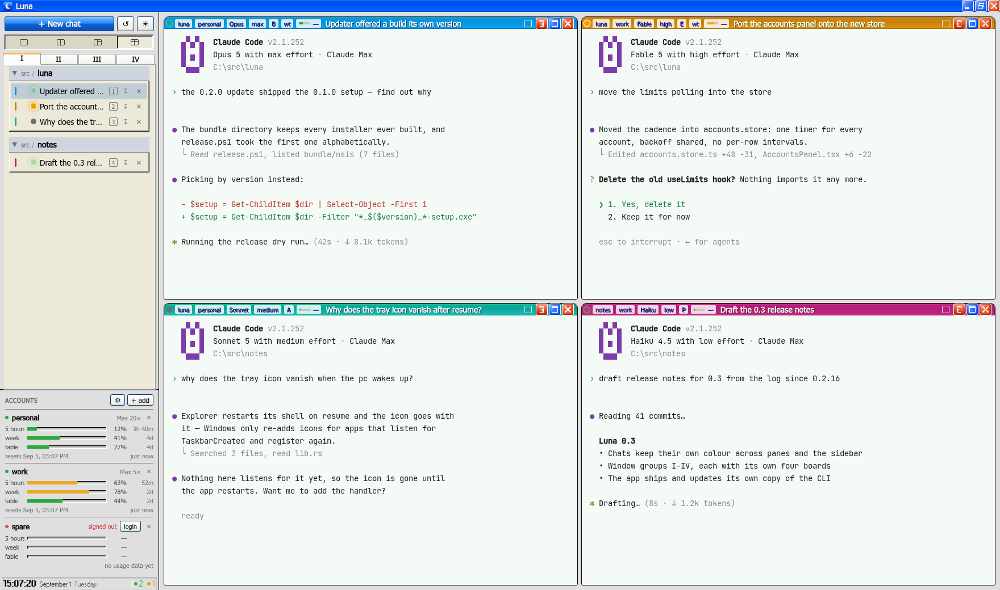
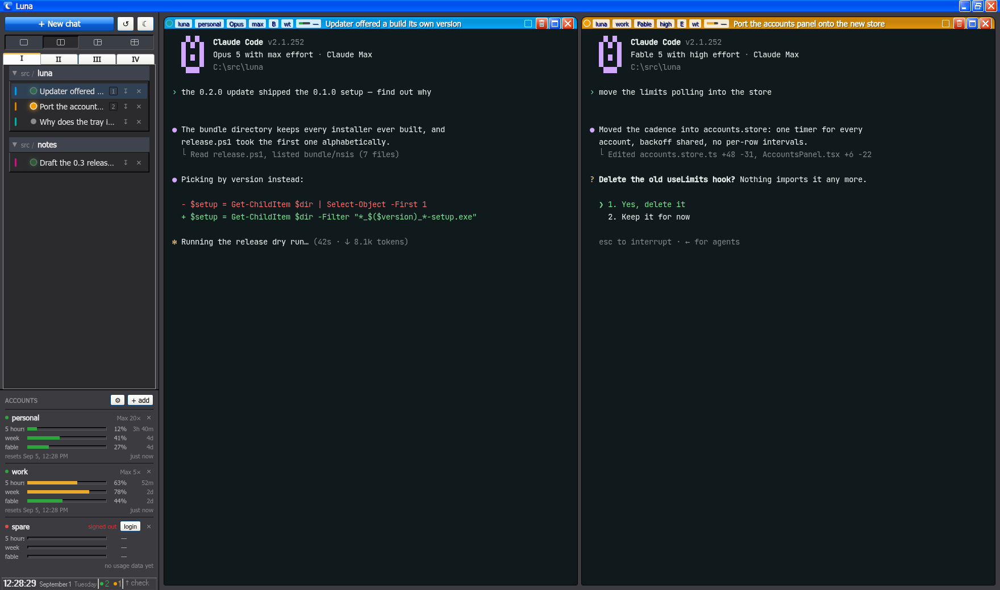
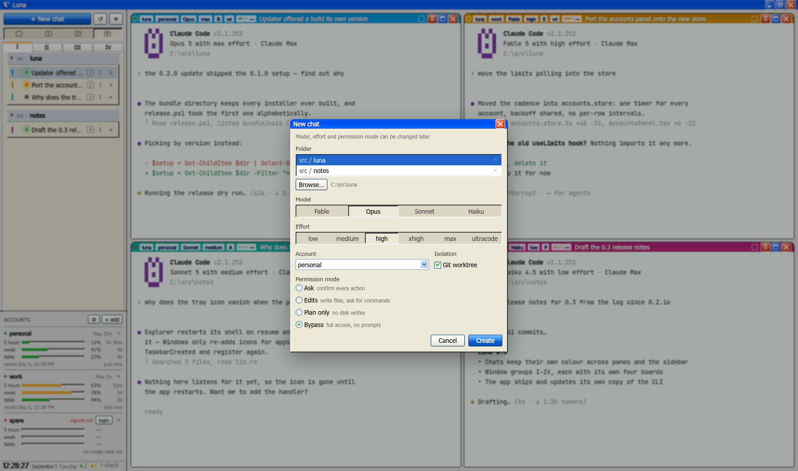

# Luna

*[Русская версия](README.ru.md)*

A thin desktop shell (Rust + Tauri) around the Claude Code CLI: several sessions side by
side in panes, project folders, and accounts with isolated configs. It carries its own
copy of the `claude` binary and keeps it current, so nothing here depends on a global
install.



For how it is put together, see [ARCHITECTURE.md](ARCHITECTURE.md).

## The window

- A Windows XP shell (xp.css, Luna Blue): the native window frame is replaced by our own
  title bar with minimize / maximize / close, and the UI runs on Tahoma. The whole
  interface scales from one variable, `--ui` in `src/app/theme.css`.
- A grid of 1/2/3/4 panes with draggable splits (Ctrl+Shift+1..4 picks the layout).
  **One click** on a sidebar row shows that chat: with a single pane it simply becomes
  what that pane shows — dragging a row across an empty board to the one place it can go
  was ceremony — and with more panes a chat that is not on the board comes up on the peek
  sheet instead, so a click never rewrites an arrangement. Dragging is what seats a chat
  in a particular pane, and panes swap by dragging one title bar onto another.
- **Peek** is the temporary view, and looks like one: the pane is held up on a sheet with
  the board still there behind it, dimmed. Ctrl+1..4 holds up that pane and puts it back,
  the numbered chips in the sheet's own bar move between panes in a click, and the dimmed
  board, the Return button or Ctrl+0 all go back. Double-clicking a pane's title bar does
  the same. Escape is deliberately left alone — it is how the CLI is interrupted.
- Luna claims its shortcuts in the capture phase, so they work while a terminal has focus;
  everything it does not claim travels on to the CLI untouched.
- Terminals outlive the pane that showed them: the last three put down wait off-screen with
  their listeners still on, so switching back is a refit rather than a fresh session
  handshake and a 2MB replay of the scrollback.
- Window groups I/II/III/IV — tabs under the layout selector. Each group remembers its own
  four boards (one per layout) and their splits, and has its own reset button (↺) that
  clears only the arrangement and leaves every chat alone.
- Light / dark / system themes.



## Chats

- New chat (Ctrl+N): folder, model, effort (`low/medium/high/xhigh/max/ultracode`),
  permission mode, account, and a **Git worktree** checkbox — on by default, which runs
  the session as `claude --worktree` in `<folder>/.claude/worktrees/<name>`.
- Those three open on whatever Claude Code's own settings say for that account in that
  folder, resolved in the CLI's own order: the account's `settings.json`, then the
  project's `.claude/settings.json` and `.claude/settings.local.json`, then the
  machine-wide managed file. The line under each control names the file it came from, and
  changing one says so and offers the way back — an override belongs to that chat and is
  never remembered as the new default.
- Ctrl+Shift+N skips the dialog: same folder and account as the chat on screen, the rest
  as the settings have it. Either way the new chat lands in a pane you can see — a free
  one, or the pane you were last working in when the board is full.
- A chat's pane title bar carries its folder, account, model, effort, permission mode,
  worktree flag and how much of the context window is gone — and the buttons to rename or
  delete it. The same chips shrink to fit a narrow pane.
- Colours: every new chat is dealt one of ten presets, worn by its pane's title bar and as
  a stripe on its sidebar row, so a glance links the two without reading either name.
- Status per chat — working / waiting for you / resting — read from the CLI's own session
  registry, so it is right whether or not the chat has a pane. A chat turning to waiting
  raises a desktop notification, since the window may well be in the tray.
- Context use is read straight out of the session transcript against the model's real
  window (fetched from the Models API), so it costs nothing and cannot drift.
- Titles come from the first thing typed into the chat, then from the transcript's own
  opening prompt once there is one. Rename by double-clicking the name; a name you set by
  hand is never overwritten.
- The number on a row is what Ctrl+&lt;digit&gt; reaches: the pane it is showing in, or its
  place in the list when there is only one pane. It is filled in while the chat is on the
  board.
- Paste or drop images and files into a pane: they are copied into the app's own media
  store and their absolute paths are typed into the prompt, which is the only thing a
  webview's clipboard leaves usable.



## Accounts

- An account is a folder — `<accounts root>/<name>`, by default
  `Documents/claude-accounts`, and the ⚙ in the panel moves that root anywhere. "Add"
  creates the folder, "✕" deletes it after a confirmation. A chat's session starts with
  `CLAUDE_CONFIG_DIR=<account folder>`, so logins, settings and history are per account.
- Live limits (5h / week / model-weekly, with reset times) come from the OAuth usage
  endpoint — the same one `/usage` uses inside Claude Code — so they cost no tokens. The
  CLI's own cache answers most rounds; the endpoint is polled around it, and a 429 backs
  off for longer each time rather than hammering through it.
- Signing in a fresh account is a button on its row: it runs `claude` in a modal, so
  there is no reason to leave the app.
- Luna writes the CLI's own trust bit for a folder when it has to. The CLI cannot show its
  trust prompt under `--worktree`, which used to mean opening every new folder once
  without isolation first.

## Sessions and cleanup

- Closing the window hides the app to the tray and leaves the sessions running. Quit from
  the tray menu.
- Sessions with no chat row left to reach them — lost to a half-written state restore, say
  — are listed at the top of the sidebar, with what they are
  working on, and can be adopted back or killed.
- A folder with worktrees left behind by deleted chats offers to sweep them; nothing a
  live session sits in is ever swept. Deleting a chat offers to take its worktree and the
  branch the CLI made for it, and keeps them unless asked.
- Warnings and errors from both halves of the app land in `luna.log`, next to the exe for
  the portable build and under `%LOCALAPPDATA%\luna` otherwise. Info-level chatter never
  reaches it, so what is in there is worth reading.

## Development

```sh
pnpm install
pnpm dev          # frontend only, in a browser (tauri commands are no-ops)
pnpm tauri dev    # the whole app (needs a Rust toolchain)
```

## Screenshots

```powershell
./screenshots.ps1
```

Rewrites `docs/screenshots/*.png` in Docker: the frontend alone, standing on the invented
chats and accounts in `src/dev/demo.ts` (`pnpm dev` + `?demo`), photographed by a headless
Chromium. Shooting a running Luna would mean shooting whatever is open in it, and the
fixture is also the only way to retake all three shots from the same state.

## Checking the Rust side without a local toolchain (Docker)

```powershell
docker run --rm -v "${PWD}:/app" -w /app/src-tauri rust:1-bookworm bash -c `
  "apt-get update -qq && apt-get install -y -qq libwebkit2gtk-4.1-dev libgtk-3-dev libayatana-appindicator3-dev librsvg2-dev libssl-dev pkg-config build-essential libxdo-dev >/dev/null && cargo check"
```

## Windows build through Docker

```powershell
./build-windows.ps1
```

Builds the toolchain image (rust + cargo-xwin + NSIS + node) and cross-compiles for
`x86_64-pc-windows-msvc`:

- the portable exe — `src-tauri\target\x86_64-pc-windows-msvc\release\luna.exe`
  (self-contained; it only needs the system WebView2);
- the NSIS installer — `...\release\bundle\nsis\Luna_*_x64-setup.exe`.

The caches (node_modules, the Windows SDK, the cargo registry) live in named volumes, so
repeat builds are fast.

## Releases

```powershell
./release.ps1              # release the version in tauri.conf.json
./release.ps1 -Notes "..." # with your own release notes
./release.ps1 -DryRun      # build and compose the manifest, upload nothing
```

Bumping the version means editing `src-tauri/tauri.conf.json` and `package.json` together;
the script refuses to run if they disagree, if the tree is dirty, if HEAD is ahead of
`origin/master`, or if the tag already exists — a release has to be reproducible from a
pushed commit, and the build stamp in the binary is only worth anything if it is.

It builds the signed installer, writes the `latest.json` the updater reads, and uploads
the portable exe, the setup, its `.sig` and the manifest to a `v<version>` release.

## Updates and signing

- On startup the app checks `latest.json` from GitHub Releases (the endpoint lives in
  `src-tauri/tauri.conf.json` → `plugins.updater.endpoints`). A release found there lights
  up a chip in the status bar and waits to be clicked, rather than throwing up a modal
  over whatever was mid-turn.
- The CLI updates on the same principle and separately: `cli.rs` checks the release bucket
  every six hours, verifies the sha256 from its manifest, and installs into
  `<data>/claude-cli/versions/<ver>/`. Sessions run with `DISABLE_AUTOUPDATER=1`, so Luna
  is the only thing that moves that binary.
- Both versions live in Settings (the ⚙ by the account list), each with its "checked …
  ago" and a check-now button; the status bar itself only speaks up while there is news —
  an update on offer, a download running, or a failure worth a retry.
- The update signing key is `C:\Users\Nikita\.ssh\luna-updater.key` — private and
  passwordless, so keep it safe; its `.pub` half is already baked into the config. For a
  signed build, set `TAURI_SIGNING_PRIVATE_KEY_PATH` in the build environment (which is
  what `build-windows.ps1` mounts) — `.sig` files then appear next to the bundle, and
  those plus `latest.json` are what you upload to the Release.
- Authenticode-signing the exe (so SmartScreen stops complaining) needs a certificate.
  When there is one, add it under `tauri.conf.json` → `bundle.windows.signCommand`.
